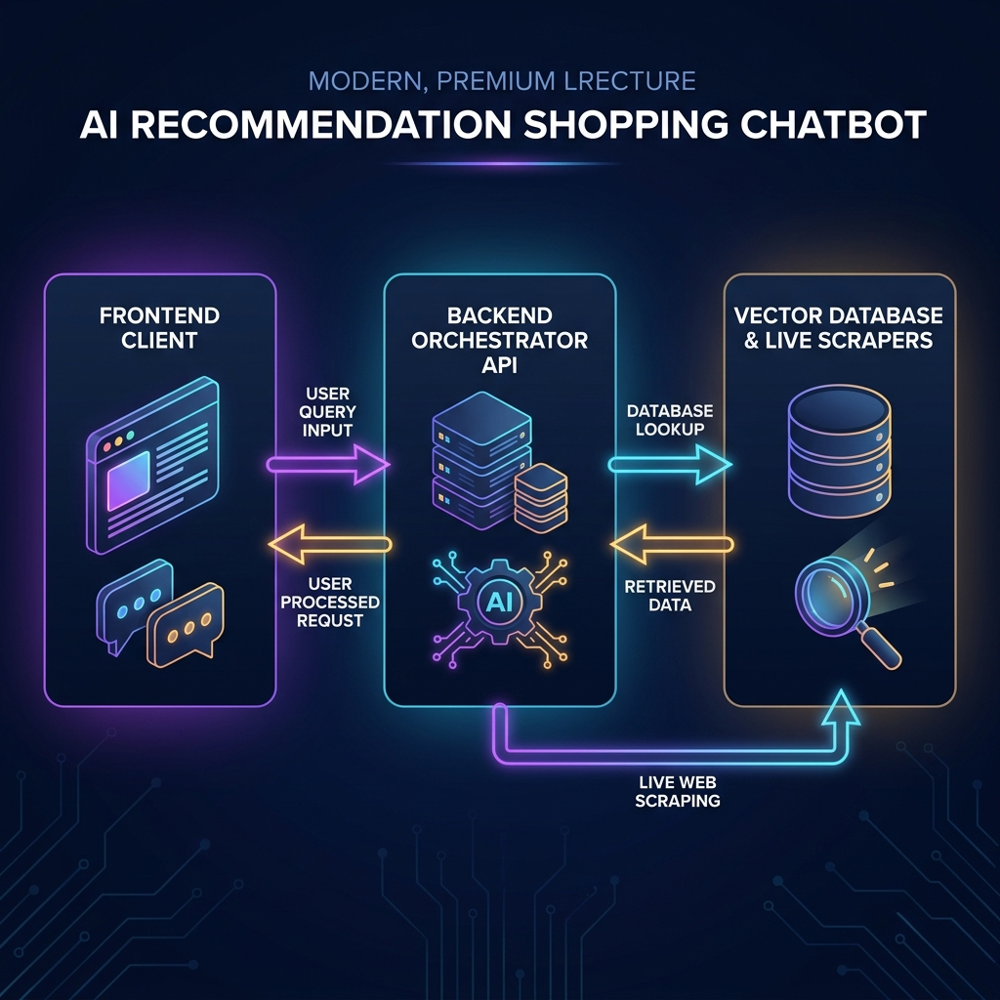

# End-to-End System Workflow: SmartAssociate Chatbot

This document details the A-to-Z execution flow of the **SmartAssociate Intelligent Recommendation Chatbot** system. It traces the lifecycle of a query from the moment a user submits it in the frontend, through the intent parsing, local vector indexing, live web scraping, background tasks, and LLM-assisted generation in the backend, and back to dynamic updates in the user interface.

---

## 1. System Architecture Overview

The system is composed of a **React + Tailwind CSS** frontend using **Zustand** for state management, communicating with a **FastAPI** backend. It leverages **ChromaDB** for local vector storage, **Apify / Tavily** for live web scraping, and **Gemini / Ollama** for LLM orchestration.

### High-Level Workflow Diagrams



#### Sequence Diagram

```mermaid
sequenceDiagram
    autonumber
    actor User as E-commerce Customer
    participant FE as Frontend Client (React)
    participant Store as Zustand State (chatStore.js)
    participant BE as Backend API (FastAPI)
    participant Pipe as Shopping Pipeline
    participant DB as Vector DB (ChromaDB)
    participant Scrape as Live Scraper (Apify/Tavily)
    participant LLM as LLM Orchestrator (Ollama/Gemini)

    Note over FE, BE: 1. Initialization (Establishes SSE Session Connection)
    FE->>BE: GET /chat/stream/{session_id}
    BE-->>Store: Connected (Ready to push real-time background results)

    Note over User, FE: 2. Query Submission
    User->>FE: Types query (e.g., "Men's running shoes under ₹3000")
    FE->>Store: sendMessage(messageText)
    Store->>BE: HTTP POST /chat (payload: message, history, activeChatId)

    Note over BE, Pipe: 3. Execution Pipeline (run_pipeline)
    BE->>Pipe: Run pipeline tasks
    
    rect rgb(24, 28, 41)
        Note over Pipe: context analysis, intent classification, category mapping
        opt Gender Unknown in Fashion Categories
            Pipe-->>BE: Returns ResponseType = NEEDS_CLARIFICATION
            BE-->>Store: HTTP 200 (needs clarification questions)
            Store-->>FE: Render multiple choice chips (Men / Women / Both)
        end
    end

    Note over Pipe, DB: 4. Retrieval & Ranking
    Pipe->>DB: Semantic vector query on category collection
    DB-->>Pipe: Returns matching local product list
    Pipe->>Pipe: Keyword re-scoring, budget constraints & composite calculation

    alt Case A: High Relevance Local Match (Composite Score >= 0.70)
        Pipe-->>BE: Returns cached local products
        BE->>Store: HTTP 200 ChatResponse (immediate display)
        Store->>FE: Renders local products to UI (instant load)

        Note over BE, Scrape: Asynchronous Background Discovery
        BE->>Scrape: Spawn background discovery task (Google Shopping/Amazon)
        Scrape-->>BE: Returns raw live products
        BE->>Pipe: Score relevance, gender filters & budget validation
        BE->>DB: Store new unique products in ChromaDB
        BE->>Store: Broadcast "new_products" payload via SSE stream
        Store->>FE: Dynamic state update: Appends new products to existing message
    
    else Case B: Low Relevance Local Match (Composite Score < 0.70)
        Note over Pipe, Scrape: Synchronous Live Discovery Fallback
        Pipe->>Scrape: Request immediate live scraping (Apify)
        Scrape-->>Pipe: Returns raw live products
        Pipe->>Pipe: Score relevance, gender filters & budget validation
        Pipe->>DB: Store new unique products in ChromaDB
        Pipe-->>BE: Returns live scraped products
        BE->>Store: HTTP 200 ChatResponse (live loaded data)
        Store->>FE: Renders scraped products to UI (delayed load)
    end
```



#### Functional Flowchart

```mermaid
graph TD
    %% Node Styling Definitions
    classDef startEnd fill:#E1BEE7,stroke:#8E24AA,stroke-width:2px,color:#000;
    classDef client fill:#B3E5FC,stroke:#0288D1,stroke-width:2px,color:#000;
    classDef backend fill:#C8E6C9,stroke:#388E3C,stroke-width:2px,color:#000;
    classDef external fill:#FFE082,stroke:#F57C00,stroke-width:2px,color:#000;
    classDef decision fill:#FFCCBC,stroke:#D84315,stroke-width:2px,color:#000;

    Start([User enters Chat Page]) :::startEnd
    Start --> InitStream[1. Open SSE stream connection to /chat/stream/session_id] :::client
    InitStream --> SendQuery[2. User types shopping query & clicks Send] :::client
    SendQuery --> PostRequest[3. HTTP POST /chat request sent to FastAPI] :::client
    PostRequest --> PipelineStart[4. run_pipeline processes message & history] :::backend
    
    PipelineStart --> Classification[5. KeywordService extracts detailed intent] :::backend
    Classification --> IntentCheck{Is intent a Shopping query?} :::decision
    
    IntentCheck -->|No: GREETING or GENERAL| GeneralResp[Return conversational text from LLM] :::backend
    IntentCheck -->|Yes: RECOMMEND/COMPARE/BUNDLE| GenderCheck{Is Category Fashion & Gender missing?} :::decision
    
    GenderCheck -->|Yes| Clarification[Return ResponseType = NEEDS_CLARIFICATION] :::backend
    GenderCheck -->|No / Solved| VectorSearch[6. Search collections in ChromaDB] :::backend
    
    VectorSearch --> Scoring[7. Apply Keyword match & Budget penalties] :::backend
    Scoring --> ScoreCheck{Max Composite Score >= 0.70?} :::decision
    
    ScoreCheck -->|Yes: Local Hit| FastReturn[8. Return local products immediately in HTTP response] :::backend
    ScoreCheck -->|No: Local Miss| SyncScraping[8. Synchronously scrape Apify for new items] :::external
    
    FastReturn --> BGTask[9. Spawn discover_and_update_products_task in background] :::backend
    BGTask --> BGScraping[10. Apify scraper runs asynchronously] :::external
    BGScraping --> BGEval[11. Calculate Relevance Scores & filter duplicates] :::backend
    BGEval --> BGStore[12. Store new products in ChromaDB] :::backend
    BGStore --> SSEBroadcast[13. Broadcast new_products event via SSE Stream] :::backend
    SSEBroadcast --> StateUpdate[14. React app updates Zustand state & appends items] :::client
    
    SyncScraping --> SyncEval[9. Calculate relevance, filter & store in ChromaDB] :::backend
    SyncEval --> SlowReturn[10. Return live products in primary HTTP response] :::backend
    
    SlowReturn --> MainUpdate[11. React app renders product grids] :::client
    GeneralResp --> MainUpdate
    Clarification --> RenderChips[Render clickable clarification choice chips] :::client
    
    MainUpdate --> End([Interactive Shopping Grid Rendered]) :::startEnd
    RenderChips --> End
```

---

## 2. Phase-by-Phase Technical Walkthrough

### Phase 1: Frontend Initialization & Input
1. **SSE Session Initialization:**
   * When a user loads the app or switches chats, `useEffect` in [App.jsx](file:///C:/Users/Admin/OneDrive/Desktop/bas%20time%20pass/recommandtion%20chatbot/frontend/src/App.jsx) invokes `setupStream(chatId)` from [chatStore.js](file:///C:/Users/Admin/OneDrive/Desktop/bas%20time%20pass/recommandtion%20chatbot/frontend/src/store/chatStore.js).
   * This opens a Server-Sent Events (SSE) stream via `EventSource` on `${API_BASE_URL}/chat/stream/{session_id}`.
   * The backend's [ConnectionManager](file:///C:/Users/Admin/OneDrive/Desktop/bas%20time%20pass/recommandtion%20chatbot/backend/routers/chat.py) registers an active `asyncio.Queue` for this session ID, waiting for broadcast events.
2. **User Input Event:**
   * The user enters a shopping query (e.g. *"running shoes under ₹3000"*) and presses **Enter** or clicks **Send**.
   * [App.jsx](file:///C:/Users/Admin/OneDrive/Desktop/bas%20time%20pass/recommandtion%20chatbot/frontend/src/App.jsx) triggers `sendMessage(messageText)`, adding the user message instantly to the conversation log to ensure UI responsiveness. It transitions the application state to `loading: true`.

---

### Phase 2: Gateway & API Routing
1. **Network Request:**
   * The frontend stores make a POST request to `/chat` with a [ChatRequest](file:///C:/Users/Admin/OneDrive/Desktop/bas%20time%20pass/recommandtion%20chatbot/backend/schemas.py) payload:
     ```json
     {
       "message": "running shoes under ₹3000",
       "history": [...],
       "activeChatId": "chat-ab12cd34"
     }
     ```
2. **Router Handling:**
   * The request hits the [chat_endpoint](file:///C:/Users/Admin/OneDrive/Desktop/bas%20time%20pass/recommandtion%20chatbot/backend/routers/chat.py) endpoint inside FastAPI.
   * If a `page_token` query parameter exists, it delegates to `_handle_pagination` for pulling next-page items. Otherwise, it invokes the shopping orchestrator.

---

### Phase 3: Intent Classification & Context Mapping
The FastAPI router triggers [run_pipeline](file:///C:/Users/Admin/OneDrive/Desktop/bas%20time%20pass/recommandtion%20chatbot/backend/pipeline/shopping_pipeline.py) to initiate the processing sequence:
1. **Clarification Context Resolution:**
   * If the previous assistant message asked for clarification (such as *"Are you looking for Men's or Women's products?"*) and the user answers (e.g. *"Men's"*), the pipeline automatically combines the previous query with the new answer to form a single, context-aware query (*"running shoes under ₹3000 Men's"*).
2. **Intent Parsing:**
   * The query is analyzed by `KeywordService.extract_detailed_intent` in [keyword_service.py](file:///C:/Users/Admin/OneDrive/Desktop/bas%20time%20pass/recommandtion%20chatbot/backend/services/keyword_service.py).
   * It classifies the query's **intent** (e.g., `RECOMMEND`, `COMPARE`, `BUNDLE`, `EXPLAIN`, `GREETING`, `GENERAL`) and parses entity details:
     * **Keywords** (e.g., `["running", "shoes"]`)
     * **Predicted Category** (e.g., `footwear`)
     * **Budget Constraints** (e.g., `3000.0` parsed via regex)
     * **Brand Preferences** (e.g., `["Adidas", "Nike"]`)
3. **Conversational Intent Override:**
   * If the intent is `GREETING` or `GENERAL`, the pipeline bypasses product searches entirely, formats the history, calls the LLM, and returns immediately.
4. **Gender Clarification Checks:**
   * For shopping categories like `fashion`, `footwear`, and `beauty`, if the query lacks a specific gender constraint, the pipeline returns a `NEEDS_CLARIFICATION` state with a question: *"Are you looking for Men's or Women's products?"* along with clickable options `["Men", "Women", "Both"]`.

---

### Phase 4: Local Database Query (Retrieval)
If the query passes intent validation:
1. **ChromaDB Target Collection Mapping:**
   * The pipeline looks up fallback categories (e.g. matching `footwear` first, falling back to `fashion` then `other`) from `CATEGORY_FALLBACK_MAP`.
2. **Vector Space Matching:**
   * It calls `VectorService.search_all_collections` in [vector_service.py](file:///C:/Users/Admin/OneDrive/Desktop/bas%20time%20pass/recommandtion%20chatbot/backend/services/vector_service.py).
   * The query string is converted to a vector embedding using [EmbeddingService](file:///C:/Users/Admin/OneDrive/Desktop/bas%20time%20pass/recommandtion%20chatbot/backend/services/embedding_service.py) (e.g. via local SentenceTransformers or an external model).
   * It queries the local ChromaDB database and fetches up to **50 matching products** based on cosine similarity.

---

### Phase 5: Re-Scoring, Penalizing & Ranking
Raw database matches undergo fine-grained ranking calculations to find the best items:
1. **Keyword Match Boost:**
   * `_apply_keyword_scores` iterates over vector results. It looks for exact occurrences of parsed terms in the product name and brand, boosting matching products.
2. **Composite Score Calculation:**
   * The [RecommendationService](file:///C:/Users/Admin/OneDrive/Desktop/bas%20time%20pass/recommandtion%20chatbot/backend/services/recommendation_service.py) computes a weighted score for each item:
     * **Category Match:** (Weight: `0.25`)
     * **Keyword Frequency Match:** (Weight: `0.15`)
     * **Semantic Similarity Vector Score:** (Weight: `0.30`)
     * **Budget Penalty:** (Weight: `0.20`). Rejects products priced over budget, or scores them down if they fall far outside the specified price point.
     * **Brand Preference:** (Weight: `0.05`)
     * **Occasion/Style Match:** (Weight: `0.05`)
3. **Top Results Partitioning:**
   * Products are sorted by composite score. The top 5 items are sliced as the principal recommendation list.

---

### Phase 6: Sync vs. Async Data Source Selection
The system inspects the relevance of the best matching local item to decide how to fetch data:

#### Case A: Cache Hit (Highest Composite Score >= 0.70)
* **Rationale:** Local databases already contain highly relevant products. There is no need to keep the user waiting.
* **Orchestration:**
  1. The API immediately builds and returns the local product list in a HTTP 200 payload.
  2. The UI renders this list instantly, resolving the loading spinner.
  3. FastAPI registers a **non-blocking background task**: `discover_and_update_products_task`.
  4. The background task calls [ApifyService](file:///C:/Users/Admin/OneDrive/Desktop/bas%20time%20pass/recommandtion%20chatbot/backend/services/apify_service.py) asynchronously to pull new web results.
  5. Scraped items are scored and validated.
  6. Unique new products are stored in ChromaDB and **broadcasted** to the user session using SSE.

#### Case B: Cache Miss (Highest Composite Score < 0.70)
* **Rationale:** Local data is outdated or insufficient. A fresh live scraping session is required before displaying items.
* **Orchestration:**
  1. The pipeline halts execution to call `ApifyService.discover_products` **synchronously**.
  2. The Google Shopping / Amazon Web Scrapers fetch raw product lists from live online stores.
  3. Scraped products are evaluated for relevance:
     * Discards items with a score below `0.6`.
     * Applies strict gender rules (e.g. ensuring ladies' items are omitted if a user requested men's gear).
  4. Unique products are inserted into ChromaDB.
  5. The API builds a response payload containing these scraped items and returns it in the primary HTTP 200 thread.

---

### Phase 7: LLM Generation & Feature Context
In parallel with product processing, context generation occurs:
1. **Natural Response Formulation:**
   * If the user refers to previous products (*"What are the specs for the first one?"*), `_generate_product_response` reads the chat history, extracts details for the last shown items, and prompts the LLM to write a concise, conversational answer.
2. **Comparison Matrix Generation:**
   * If the intent is `COMPARE` and multiple products are checked, `_generate_comparison` calls the LLM with a specialized system prompt, requiring it to return a JSON containing compared specifications (e.g. Display, Processor, Price, Rating) and a markdown summary.
   * If the LLM is offline or fails, a **local fallback heuristic** compares prices, ratings, and specification dictionaries automatically.

---

### Phase 8: Frontend Response Rendering
Upon receiving the server response, the Zustand store processes the payload:
1. **Product Deduplication:**
   * `deduplicateProducts` in [chatStore.js](file:///C:/Users/Admin/OneDrive/Desktop/bas%20time%20pass/recommandtion%20chatbot/frontend/src/store/chatStore.js) sanitizes product URLs and filters out redundant elements before storing them in local client states.
2. **Component Dispatch & Re-rendering:**
   * React updates the DOM to display:
     * **Search Context Badges:** Showing keywords used, source, and search filters.
     * **Product Card Grids:** Rendering product image, title, price, brand, rating, and add-to-cart controls.
     * **Side-by-Side Comparison Panels:** Visual tables comparing item attributes if the comparison view was requested.
     * **Conversational AI Chat Bubbles:** Formatted using markdown parsing for natural reading.

---

### Phase 9: Real-Time Dynamic Stream Notifications (For Background Runs)
For queries resolved under **Case A (Cache Hit)**, the background scraping task completes asynchronously:
1. **SSE Broadcast Call:**
   * Once `discover_and_update_products_task` filters and registers new items into ChromaDB, it builds a notification packet:
     ```json
     {
       "type": "new_products",
       "count": 4,
       "products": [...]
     }
     ```
   * It calls `manager.broadcast(session_id, notification_data)`.
2. **SSE Client Dispatch:**
   * The `onmessage` listener of the `EventSource` in [chatStore.js](file:///C:/Users/Admin/OneDrive/Desktop/bas%20time%20pass/recommandtion%20chatbot/frontend/src/store/chatStore.js) captures the event.
   * It merges the new items with the products already displayed on the last assistant message.
   * A soft notification (*"4 new product(s) found and appended below"* or a subtle system badge) highlights the update.
   * React detects the state changes and appends the newly scraped products smoothly with framer-motion animations.

---

## 3. Data Flow Payload Schemas

### 1. HTTP POST Request Payload (`ChatRequest`)
Passed from [chatStore.js](file:///C:/Users/Admin/OneDrive/Desktop/bas%20time%20pass/recommandtion%20chatbot/frontend/src/store/chatStore.js) to `/chat`:
```json
{
  "message": "Gaming laptop under Rs 80000",
  "history": [
    {
      "role": "user",
      "content": "Hi, I need a laptop",
      "timestamp": "09:15 PM"
    },
    {
      "role": "assistant",
      "content": "Sure, what is your budget and use case?",
      "timestamp": "09:15 PM"
    }
  ],
  "activeChatId": "chat-xy98wz"
}
```

### 2. Primary HTTP Response Payload (`ChatResponse`)
Returned by [chat_endpoint](file:///C:/Users/Admin/OneDrive/Desktop/bas%20time%20pass/recommandtion%20chatbot/backend/routers/chat.py):
```json
{
  "message": "Here are the top laptops for gaming within your Rs 80,000 budget.",
  "response_type": "RECOMMEND",
  "search_context": {
    "keywords_used": "gaming, laptop",
    "semantic_description": "Gaming laptops, notebook electronics",
    "inferred_context": "Budget: <= 80,000 INR",
    "target_sites": ["Google Shopping"],
    "data_source": "local",
    "query_hash": "2b3c4d5e..."
  },
  "products": [
    {
      "id": "prod-1",
      "name": "ASUS TUF Gaming F15",
      "brand": "ASUS",
      "price": 74990.0,
      "rating": 4.3,
      "image": "https://example.com/tuf.jpg",
      "url": "https://example.com/tuf",
      "category": "laptops",
      "specs": {
        "processor": "Intel i5 11th Gen",
        "ram": "8GB DDR4",
        "gpu": "RTX 3050"
      }
    }
  ],
  "comparison": null,
  "bundle": null,
  "follow_up_questions": [
    "ASUS TUF specs",
    "Gaming laptop under Rs 100000"
  ],
  "data_freshness": "local",
  "pagination_token": "5",
  "total_products": 12
}
```

### 3. Server-Sent Events Payload (`new_products` event)
Pushed over GET `/chat/stream/{session_id}` connection:
```json
data: {
  "type": "new_products",
  "count": 1,
  "products": [
    {
      "id": "prod-scraped-1",
      "name": "Lenovo IdeaPad Gaming 3",
      "brand": "Lenovo",
      "price": 78500.0,
      "rating": 4.2,
      "image": "https://example.com/ideapad.jpg",
      "url": "https://example.com/ideapad",
      "category": "laptops",
      "specs": {
        "processor": "AMD Ryzen 5 5600H",
        "ram": "16GB DDR4",
        "gpu": "RTX 3050 Ti"
      }
    }
  ]
}
```

---

## 4. Key Orchestration Services Reference Index

| File Component | Code Symbol / Class | Responsibility |
| :--- | :--- | :--- |
| [main.py](file:///C:/Users/Admin/OneDrive/Desktop/bas%20time%20pass/recommandtion%20chatbot/backend/main.py) | `FastAPI` instance | Server bootstrapper, global CORS middleware registration, and API router assembly. |
| [chat.py](file:///C:/Users/Admin/OneDrive/Desktop/bas%20time%20pass/recommandtion%20chatbot/backend/routers/chat.py) | [ConnectionManager](file:///C:/Users/Admin/OneDrive/Desktop/bas%20time%20pass/recommandtion%20chatbot/backend/routers/chat.py#L22) | Maintains persistent stream channels for broadcasting background crawler additions. |
| [shopping_pipeline.py](file:///C:/Users/Admin/OneDrive/Desktop/bas%20time%20pass/recommandtion%20chatbot/backend/pipeline/shopping_pipeline.py) | [run_pipeline](file:///C:/Users/Admin/OneDrive/Desktop/bas%20time%20pass/recommandtion%20chatbot/backend/pipeline/shopping_pipeline.py#L71) | Main controller that determines cache hits/misses, parses gender constraints, retrieves local models, and interfaces with LLM gateways. |
| [keyword_service.py](file:///C:/Users/Admin/OneDrive/Desktop/bas%20time%20pass/recommandtion%20chatbot/backend/services/keyword_service.py) | `KeywordService` | Uses lexical classifiers to filter user parameters: budgets, styles, preferred brands, and category tags. |
| [vector_service.py](file:///C:/Users/Admin/OneDrive/Desktop/bas%20time%20pass/recommandtion%20chatbot/backend/services/vector_service.py) | `VectorService` | Manages interactions with ChromaDB, query embedding matches, and product inserts. |
| [recommendation_service.py](file:///C:/Users/Admin/OneDrive/Desktop/bas%20time%20pass/recommandtion%20chatbot/backend/services/recommendation_service.py) | `RecommendationService` | Ranks and grades products using an ensemble scoring system. |
| [discovery_task.py](file:///C:/Users/Admin/OneDrive/Desktop/bas%20time%20pass/recommandtion%20chatbot/backend/services/discovery_task.py) | [discover_and_update_products_task](file:///C:/Users/Admin/OneDrive/Desktop/bas%20time%20pass/recommandtion%20chatbot/backend/services/discovery_task.py#L17) | Asynchronous process handler for fetching live items, validating similarity scores, and broadcasting results over SSE. |
| [chatStore.js](file:///C:/Users/Admin/OneDrive/Desktop/bas%20time%20pass/recommandtion%20chatbot/frontend/src/store/chatStore.js) | `useChatStore` | Frontend Zustand store handling localstorage caching, stream initialization, cart state modifications, and endpoint requests. |
| [App.jsx](file:///C:/Users/Admin/OneDrive/Desktop/bas%20time%20pass/recommandtion%20chatbot/frontend/src/App.jsx) | `App` | Render loop orchestrator displaying chat threads, sidebar history drawer, comparative cards, and responsive side sheets. |
